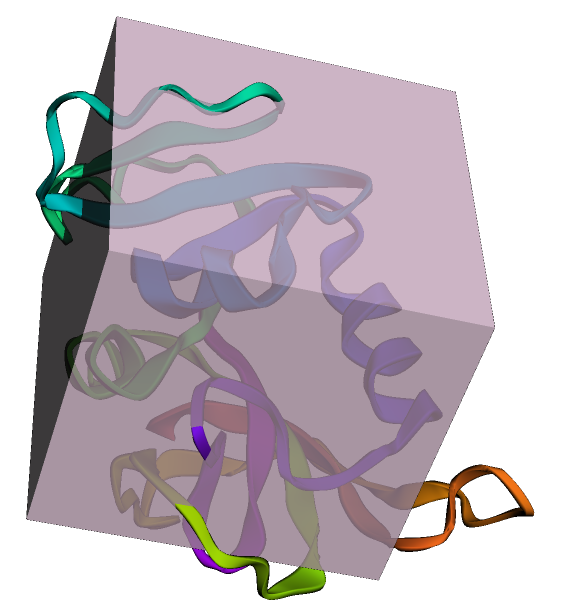
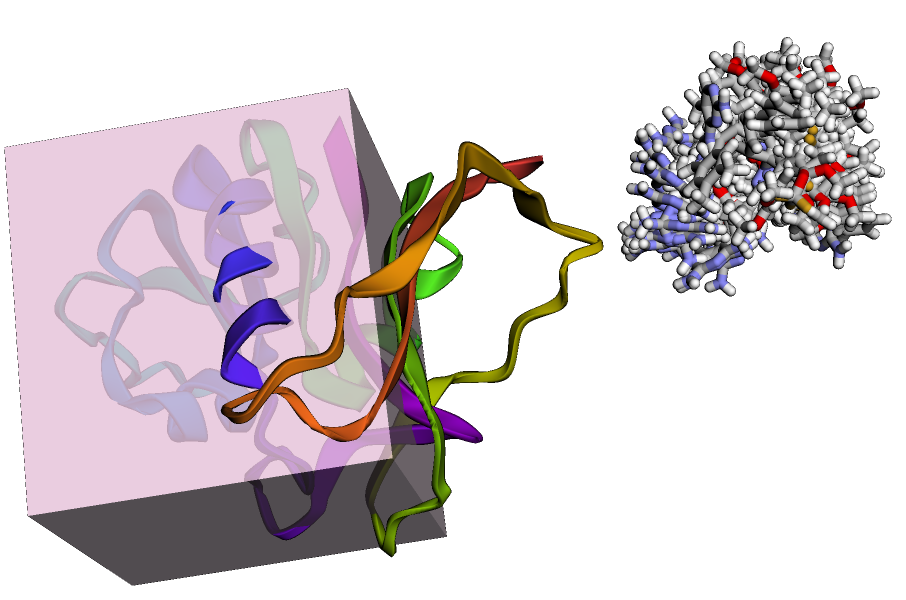
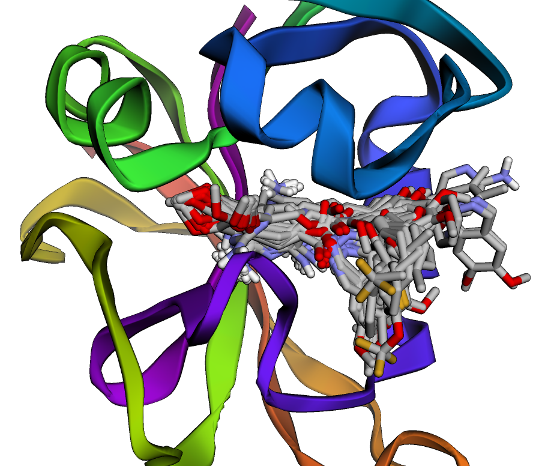
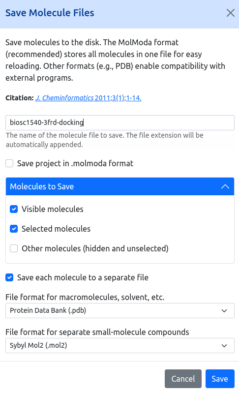

<h1 align="center">
<b>Part 3:</b> 
Docking
</h1>

!!! danger "DRAFT"

    This page is a work in progress and is subject to change at any moment.

In the ongoing battle against antibiotic-resistant bacteria, understanding the molecular interactions between drugs and their targets is crucial.
*Staphylococcus aureus* dihydrofolate reductase (DHFR) is a well-established target for several antibiotics due to its essential role in bacterial folate synthesis.
This project focuses on protein-ligand docking studies of *S. aureus* DHFR using [MolModa](https://durrantlab.pitt.edu/molmoda/#), a powerful tool for virtual screening and molecular modeling.

You will perform docking simulations to predict how various ligands bind to DHFR within different protein environments.
By comparing these predictions with experimental data, you will assess the reliability of computational docking as a method for identifying potential antibiotic candidates.
Additionally, you will explore the impact of cofactors like NADPH on ligand binding, providing insights into the complexities of protein-ligand interactions in a cellular context.

## Learning Objectives

By completing this project, you will:

1.  Comprehend the principles and significance of molecular docking in drug discovery.
2.  Navigate and utilize MolModa for preparing proteins and ligands for docking.
3.  Configure and execute docking simulations with appropriate parameters.
4.  Compare computational docking scores with experimental binding affinities (IC50, Ki, MIC).
5.  Assess the impact of cofactors, such as NADPH, on ligand binding and docking outcomes.
6.  Evaluate the correlation between docking predictions and experimental data.
7.  Generate and interpret visual representations of ligand poses and binding interactions.
8.  Analyze how decoys are scored and the implications for screening accuracy.

## Instructions

We will be using [MolModa][molmoda] to perform protein-ligand docking of *S. aureus* DHFR in the following proteins.

| PDB ID | Additional ligand |
| ------ | ----------------- |
| [3FRD](https://www.rcsb.org/structure/3FRD) | [Folate](https://www.ebi.ac.uk/chembl/explore/compound/135398658) |
| [6PRA](https://www.rcsb.org/structure/6PRA) | None |
| [6PR6](https://www.rcsb.org/structure/6PR6) | [OWS](https://pubchem.ncbi.nlm.nih.gov/compound/146170541) |

[MolModa][molmoda], unfortunately, cannot dock in the presence of cofactors (e.g. NADPH), which could impact results of our virtual screening.
Thus, the instructor will provide docking results with the NADPH cofactor while you use [MolModa][molmoda] to examine the impact of its removal.

!!! note "Important"
    We recommend that you use Google Chrome instead of other browsers.
    Some browsers (e.g., Firefox) have been shown to exhibit more bugs and not work smoothly.

### Protein preparation

Here are the general steps in [MolModa][molmoda] to prepare the protein for docking.

1.  Download [this specific `3FRD` PDB structure (click this link!)](./proteins/3frd-xray.pdb) and import it into [MolModa][molmoda] using `File` -> `Open`.
2.  Remove all non-polymer atoms (e.g., water molecules and all co-crystallized ligands) from the protein structure.
3.  Protonate the protein at a pH of 7.4.
4.  Add a region with a center of (-9, 34, -4) and dimensions of (26, 25, 27).

!!! quote "Reference image"

    After this stage, your MolModa session should look like this.
    Note that the color of your region may be different.

    <figure markdown>
    
    </figure>

### Ligand preparation

Here are the general steps in [MolModa][molmoda] to prepare the ligands for docking.

1.  Download the [active molecules' SMILES](./active.smiles) and load them into [MolModa][molmoda] by using `File` -> `Open` or by drag and drop.
2.  Protonate all compounds at a pH of 7.4 while regenerating coordinates with the "recommended" 3D coordinates generation option.

!!! quote "Reference image"

    After this stage, your MolModa session should look like this.

    <figure markdown>
    
    </figure>

### Docking

[Dock the protonated compounds](https://durrantlab.pitt.edu/molmoda/docs/docking/tutorials/td001/#docking) into the `3FRD` protein using an exhaustiveness of `24` in MolModa.
These are **your** docking results for the active compounds without NADPH.

!!! quote "Reference image"

    After this stage, your MolModa session should look like this.

    <figure markdown>
    
    </figure>

You need to download your docked ligand poses by going to `File` -> `Save`, uncheck "Save in MolModa format", and use these settings.

<figure markdown>

</figure>

This will download a zip file that you can extract and have all of your docked poses as `mol2` files.
You can load these compounds into PyMOL.

!!! note "Submission"

    In your submission, answer the following questions:

    1.  Download and extract on your computer [these docking results](./results/3frd-results.zip) that were performed in the presence of NADPH using AutoDock Vina.
        In [PyMOL](https://www.pymol.org/), load the `3frd.pdb` structure and all active `.pdbqt` files in the `poses/` directory.
        These `.pdbqt` files contain the top 9 poses of the identified binding modes.
        To see their scores, look at the respective log file in the `logs/` directory.
        Choose any three active compounds and compare these poses to your results&mdash;you can download your ligand poses from [MolModa][molmoda] by clicking `File` -> `Save` and unchecking "Save project in .molmoda format".
        Be sure to look at more than just the top pose from the NADPH results.
        Use screenshots to justify your observations.
        [(PyMol session file)](./pse/1-3frd-actives.pse.gz)

### Analysis

As mentioned in most CSB lectures, the purpose of docking is to be able to identify potentially active compounds out of the massively large chemical space.
Below is a table from [Muddala et al.](https://doi.org/10.1016/j.ejmech.2020.112412) that elucidates the binding affinity and antibacterial properties of novel ligands to *S. aureus* DHFR.

| Label | Inhibitor | Average IC50 ± SEM (nM) | Average Ki ± SEM (nM) | MIC (µg/mL) |
|-------| ----------|-------------------------|-----------------------|-------------|
| 11a | [`CHEMBL2042372`]( https://www.ebi.ac.uk/chembl/explore/compound/CHEMBL2042372) | 6.3 ± 0.3 | 1.2 ± 0.1 | 0.0625-0.25 |
| 11b | [`CHEMBL2042373`]( https://www.ebi.ac.uk/chembl/explore/compound/CHEMBL2042373) | 5.5 ± 1.0 | 1.1 ± 0.2 | 0.0469-0.0938 |
| 11c | [`CHEMBL2042374`]( https://www.ebi.ac.uk/chembl/explore/compound/CHEMBL2042374) | 8.7 ± 2.1 | 1.7 ± 0.4 | 0.0938-0.1875 |
| 11d | [`CHEMBL2042375`]( https://www.ebi.ac.uk/chembl/explore/compound/CHEMBL2042375) | 8.2 ± 0.5 | 1.6 ± 0.1 | 0.0938-0.25 |
| 11e | [`CHEMBL2042376`]( https://www.ebi.ac.uk/chembl/explore/compound/CHEMBL2042376) | 9.2 ± 0.5 | 1.8 ± 0.1 | 0.125-0.25 |
| 11f | [`CHEMBL2042377`]( https://www.ebi.ac.uk/chembl/explore/compound/CHEMBL2042377) | 13.1 ± 3.1 | 2.6 ± 0.6 | 0.5 |
| 11g | [`CHEMBL551038`]( https://www.ebi.ac.uk/chembl/explore/compound/CHEMBL551038) | 4.6 ± 0.7 | 0.9 ± 0.1 | 0.1875-0.375 |
| 11h | [`CHEMBL565020`]( https://www.ebi.ac.uk/chembl/explore/compound/CHEMBL565020) | 4.1 ± 0.4 | 0.8 ± 0.1 | 0.125-0.25 |
| 11i | [`CHEMBL2042475`]( https://www.ebi.ac.uk/chembl/explore/compound/CHEMBL2042475) | 5.8 ± 0.3 | 1.1 ± 0.1 | 0.125-0.25 |
| 11j | [`CHEMBL550083`]( https://www.ebi.ac.uk/chembl/explore/compound/CHEMBL550083) | 8.4 ± 1.7 | 1.7 ± 0.3 | 0.0469-0.1875 |
| 11k | [`CHEMBL2042476`]( https://www.ebi.ac.uk/chembl/explore/compound/CHEMBL2042476) | 7.2 ± 0.8 | 1.4 ± 0.2 | 0.25 |
| 11l | [`CHEMBL2042477`]( https://www.ebi.ac.uk/chembl/explore/compound/CHEMBL2042477) | 4.8 ± 0.8 | 0.9 ± 0.2 | 0.125 |
| 11m | [`CHEMBL2042478`]( https://www.ebi.ac.uk/chembl/explore/compound/CHEMBL2042478) | 5.7 ± 0.6 | 1.1 ± 0.1 | 0.125-0.375 |
| 11n | [`CHEMBL2042479`]( https://www.ebi.ac.uk/chembl/explore/compound/CHEMBL2042479) | 7.0 ± 0.3 | 1.4 ± 0.1 | 0.25-0.5 |
| 11o | [`CHEMBL2042480`]( https://www.ebi.ac.uk/chembl/explore/compound/CHEMBL2042480) | 11.6 ± 2.2 | 2.3 ± 0.4 | 0.5 |
| 11p | [`CHEMBL2042481`]( https://www.ebi.ac.uk/chembl/explore/compound/CHEMBL2042481) | 6.3 ± 1.9 | 1.2 ± 0.4 | 0.5 |
| 11q | [`CHEMBL2042482`]( https://www.ebi.ac.uk/chembl/explore/compound/CHEMBL2042482) | 9.6 ± 0.5 | 1.9 ± 0.1 | 1 |
| 12a | N/A | 7.7 ± 2.9 | 1.5 ± 0.6 | 1 |
| 12b | [`CHEMBL4799218`]( https://www.ebi.ac.uk/chembl/explore/compound/CHEMBL4799218) | 5.8 ± 3.3 | 1.1 ± 0.7 | 1 |
| 12c | [`CHEMBL4781757`](https://www.ebi.ac.uk/chembl/explore/compound/CHEMBL4781757) | 3.3 ± 1.7 | 0.7 ± 0.3 | 1 |
| 12d | N/A | 6.7 ± 3.9 | 1.3 ± 0.8 | 0.5-1 |
| 12e | N/A | 6.3 ± 2.8 | 1.2 ± 0.6 | 0.5 |
| 12f | N/A | 5.6 ± 2.8 | 1.1 ± 0.6 | 0.5 |
| 12g | N/A | 4.5 ± 2.6 | 0.9 ± 0.5 | 1 |
| 12h | N/A | 4.5 ± 2.2 | 0.9 ± 0.4 | 1 |
| 12i | N/A | 5.4 ± 3.1 | 1.1 ± 0.6 | 0.5 |
| 12j | N/A | 5.2 ± 2.3 | 1.0 ± 0.5 | 0.5 |
| 13a | N/A | 8.4 ± 3.8 | 1.7 ± 0.7 | 0.5-1 |
| 13b | [`CHEMBL4790501`](https://www.ebi.ac.uk/chembl/explore/compound/CHEMBL4790501) | 6.1 ± 2.7 | 1.2 ± 0.5 | 0.5-1 |
| 13c | N/A | 5.2 ± 3.0 | 1.0 ± 0.6 | 0.5 |
| 13d | N/A | 7.2 ± 3.2 | 1.4 ± 0.6 | 0.5 |
| 13e | N/A | 7.4 ± 4.2 | 1.5 ± 0.8 | 0.5 |
| 13f | N/A | 6.1 ± 2.7 | 1.2 ± 0.5 | 0.5 |

Your instructor has docked all of these active ligands (in addition to the canonical reactant, DFH) and 100 randomly selected decoys from FDA approved drugs into `3FRD`, `6PRA`, and `6PR6`.
You can download the results here: [3FRD-results.zip](./results/3frd-results.zip), [6PRA-results.zip](./results/6pra-results.zip), [6PR6-results.zip](./results/6pr6-results.zip).

!!! note "Submission"

    In your submission, answer the following questions:

    1.  What is the meaning/significance of IC50, Ki, and MIC?
    For an active molecule, what are the ideal values for these properties?
    2.  `3FRD` is a crystal structure with NADPH and DHF, which should be an optimal protein structure to design a DHF competitive inhibitor.
    Is there a correlation between AutoDock Vina docking scores (with NADPH) and experimental Ki values?
    Quantify this correlation with an R2 value.
    3.  `6PRA` is a crystal structure that does not have DHF.
    Explain how this could impact docking calculations.
    Compare the docking scores of active ligands from `6PRA` and `3FRD`; are there significant differences?
    [(PyMol session file)](./pse/4-3frd-6pra.pse.gz)
    4.  `6PR6` was crystallized with the active compound `11j`.
    Compare the crystallized ligand pose to the top 9 poses and scores of the same `11j` ligand.
    What do you observe?
    Support your claims with screenshots.
    [(PyMol session file)](./pse/4-6pr6-11j.pse.gz)
    5.  Decoy ligands provide a mechanism to ensure that virtual screening workflows work as expected.
    Using the `3FRD` results, examine the decoy scores and poses with the top three best and worst scores.
    Does our pipeline accurately sort these decoy molecules?
    Why or why not?
    Examine the top poses of these best and worst decoys.
    Are there any noncovalent interaction trends?
    Support your claims with screenshots.

<!-- LINKS -->

[molmoda]: https://durrantlab.pitt.edu/molmoda/#
