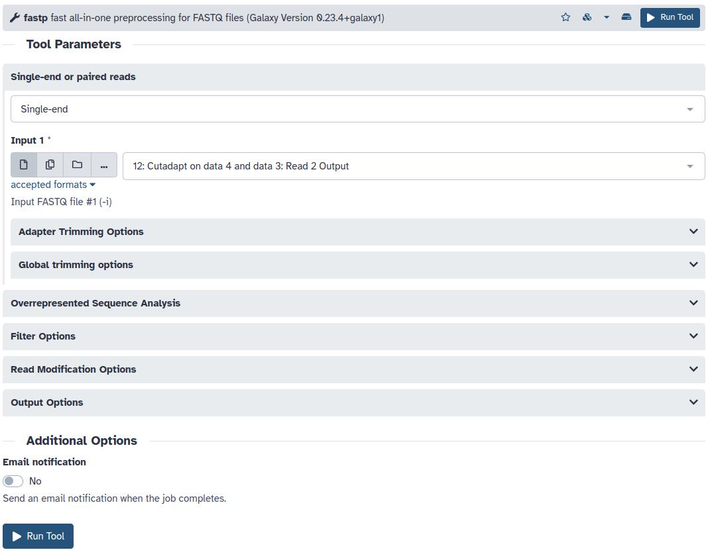

<h1 align="center">
<b>Activity</b> 
Read trimming
</h1>

Using potentially erroneous data could cause bias in downstream analyses; thus, sequences must be cleaned to reduce bias in downstream analysis.
We refer to this cleaning process as "trimming", as the problematic base calls are normally at the end of the reads.
In general, quality treatments include:

1.  Trimming/cutting/masking sequences
    -   from low quality score regions
    -   beginning/end of sequence
    -   removing adapters
2.  Filtering of sequences
    -   with low mean quality score
    -   too short
    -   with too many ambiguous (N) bases

There are several tools used to trim adapters, but there is not one that significantly outperforms the others.
They mainly differ by different default parameters, advanced features, and report options.

-   [`cutadapt`](https://cutadapt.readthedocs.io/en/stable/index.html)
-   [`trimmomatic`](https://github.com/usadellab/Trimmomatic)
-   [`fastp`](https://github.com/OpenGene/fastp)

For this activity, we will use `fastp` because of its automatic adapter detection and comprehensive analysis report.
In the Galaxy **Tools** panel on the left, click `FASTA/FASTQ` and select the "**fastp** fast all-in-one preprocessing for FASTQ files" tool.

!!! quote "Figure"
    <figure markdown>
    
    </figure>

## Data selection

Our reads ([`SRR14933407`](https://www.ncbi.nlm.nih.gov/sra/?term=SRR14933407)) are Paired-ended, so we can select either "Paired" or "Paired collection".
The only difference is that "Paired-end" makes you select both forward and reverse reads, whereas the collection will allow you to select the collection we downloaded&mdash;results will be the same.

Select the "Paired Collection" option and then "Paired-end data (fastq-dump)".

## Adapters

Adapters are unique to the DNA preparation protocol and technology employed.
Our [data source](https://www.ncbi.nlm.nih.gov/sra/?term=SRR14933407) specifies that the Nextera XT protocol and Illumina HiSeq 2000 were used.
FastQC identified the following adapter sequences in our reads:

-   **Forward:** `GATCGGAAGAGCACACGTCTGAACTCCAGTCACCGCTCATTATCTCGTAT`
     
    This is a [TruSeq Adapter, Index 1](https://support-docs.illumina.com/SHARE/AdapterSequences/Content/SHARE/AdapterSeq/TruSeq/CDIndexes.htm) containing the prefix `GATCGGAAGAGCACACGTCTGAACTCCAGTCAC`, the D703 i7 index `CGCTCATT`, and part of the suffix `ATCTCGTAT`.
-   **Reverse:** `GATCGGAAGAGCGTCGTGTAGGGAAAGAGTGTACGTCCTGGTGTAGATCT` (Illumina Single End PCR Primer 1)

Illumina provides [a list of adapters](https://support-docs.illumina.com/SHARE/AdapterSequences/Content/SHARE/FrontPages/AdapterSeq.htm) used in their products.
Since TruSeq adapters were identified, we can go to the [TruSeq DNA indexes](https://support-docs.illumina.com/SHARE/AdapterSequences/Content/SHARE/AdapterSeq/TruSeq/CDIndexes.htm) and note the specified adapter sequences for trimming:

-   **Read 1**: `AGATCGGAAGAGCACACGTCTGAACTCCAGTCA`
-   **Read 2**: `AGATCGGAAGAGCGTCGTGTAGGGAAAGAGTGT`

If we were using a tool like `cutadapt`, we would have to manually specify these.
Since these are widely used, `fastp` and `trimmomatic` can automatically detect and remove these.

For `fastp`, go to "Adapter Trimming Options" and enable "Adapter sequence auto-detection for paired-end".

## Quality

Processing data over and over again can consume a lot of resources; thus, tools often combine similar features into one run.
Instead of trimming adapters in one run and quality in another, we can simultaneously remove base calls with low accuracy.
A phred score of 20 and lower is considered poor, so we will bump up the `fastp` cutoff to `20` instead of `15`.

Under "Filter options", change the "Qualified quality phred" to `20`.

## Length

Some reads gets smaller and smaller as adapters and low-quality base calls get removed.
Once shorter than, say around 20, they can cause undue strain on downstream processing.
By going to "Length filtering options" and setting "Length required" to 20, we can remove these short reads.

Now, we can run our tool.

## Additional resources

-   [Galaxy training](https://training.galaxyproject.org/training-material/topics/sequence-analysis/tutorials/quality-control/tutorial.html#trim-and-filter---short-reads)
